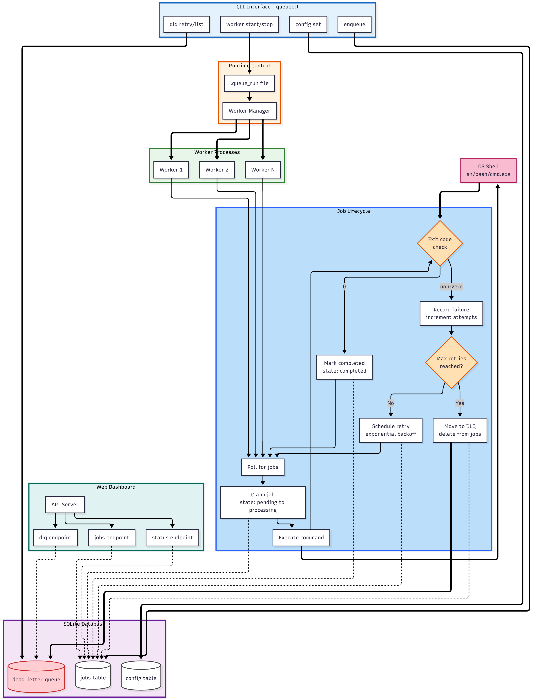

# QueueCTL 🚀

A robust and production-proven CLI-based work queue system with worker management, automatic retrying of failed jobs and support for dead letter queues.

## Overview

QueueCTL is a command line tool to effectively manage your background jobs. It is a simple but powerful way to enqueue, process and monitor background jobs, with integrated retry and dead letter queue support. 

### Key Features

- **Job Management**: Enqueue, list and monitor background jobs.
- **Worker Pool**: Start multiple worker processes concurrently.
- **Automatic Retries**: Exponential backoff for failed jobs can be customized.
- **Dead Letter Queue**: Process jobs that failed forever in a nice way.
- **Persistence**: Job state survives restarts.
- **CLI Interface**: User-friendly CLI with informative output.

##  Installation

```bash
# Clone the repository
git clone https://github.com/yourusername/queue_ctl.git
cd queue_ctl

# Install dependencies
npm install

# Make the CLI globally available
npm link
```

## References

### Core Dependencies
- [Commander.js](https://www.npmjs.com/package/commander) - Complete solution for Node.js command-line interfaces
- [SQLite3](https://www.npmjs.com/package/sqlite3) - Asynchronous SQLite3 database driver
- [Chalk](https://www.npmjs.com/package/chalk) - Terminal string styling
- [Figlet](https://www.npmjs.com/package/figlet) - ASCII art text generator
- [Ora](https://www.npmjs.com/package/ora) - Elegant terminal spinner
- [Boxen](https://www.npmjs.com/package/boxen) - Create boxes in the terminal
- [cli-table3](https://www.npmjs.com/package/cli-table3) - Beautiful formatted tables

### Learning Resources

#### CLI Development
- [How CLIs in Node.js Actually Work](https://eytanmanor.medium.com/how-clis-in-node-js-actually-work-c26f913a335e)
- [Building a Command Line Tool with Node.js](https://developer.okta.com/blog/2019/06/18/command-line-app-with-nodejs)
- [Commander.js Documentation](https://github.com/tj/commander.js#readme)


#### Queue & Background Jobs
- [Node.js Background Jobs & Workers](https://blog.logrocket.com/asynchronous-task-processing-in-node-js/)
- [Building a Job Queue in Node.js](https://blog.logrocket.com/implementing-job-queue-node-js/)

#### SQLite with Node.js
- [SQLite3 Node.js Guide](https://dev.to/simonmackie/a-comprehensive-guide-to-using-sqlite-with-nodejs-549i)
- [SQLite with Node.js Tutorial](https://www.sqlitetutorial.net/sqlite-nodejs/)

#### Error Handling & Retries
- [Exponential Backoff in Distributed Systems](https://medium.com/bobble-engineering/how-does-exponential-backoff-work-90ef02401c65)
- [Node.js Retry Strategies](https://blog.logrocket.com/rate-limiting-node-js/)

#### CLI UX Best Practices
- [Command Line Interface Guidelines](https://clig.dev/)
- [14 great tips to make amazing CLI applications](https://dev.to/wesen/14-great-tips-to-make-amazing-cli-applications-3gp3)
- [12 Factor CLI Apps](https://medium.com/@jdxcode/12-factor-cli-apps-dd3c227a0e46)


## Setup Instructions

### Prerequisites
- Node.js (v14 or higher)
- npm (v6 or higher) or yarn

### Local Development Setup

1. **Clone the repository**
   ```bash
   git clone https://github.com/yourusername/queue_ctl.git
   cd queue_ctl
   ```

2. **Install dependencies**
   ```bash
   npm install
   ```

3. **Link the CLI tool globally**
   This allows you to run `queuectl` from anywhere in your terminal.
   ```bash
   npm link
   ```

4. **Verify installation**
   ```bash
   queuectl --version
   ```
   You will see the current version of QueueCTL.

### Web Dashboard Setup

To start the web dashboard, use the following command:

```bash
nodemon dashboard.js
```

This will start the dashboard server. By default, it runs on `http://localhost:3000`.

#### Dashboard Features:
- **Real-time Status Overview**
  - Shows Current job queue status at a glance
  - Shows Number of Processing, pending, failed, dead and completed jobs
  - Shows Active Workers

- **Interactive Job Tables**
  - Sortable and searchable job listings
  - Color-coded job status indicators
  - Click any status to view detailed job information in a modal
  
- **Dead Letter Queue (DLQ) Management**
  - View all failed jobs that exceeded retry limits
  - One-click requeue functionality for failed jobs
  - Error messages and stack traces

  


### Database Setup

QueueCTL employs SQLite as the underlying persistence store. The database file (`jobs.db`) will be created automatically in the root of your project when you execute the application for the first time. 

### Common Issues

1. **Permission Denied**
   If you get permission errors while running `npm link` try:
   ```bash
   sudo npm link
   ```

2. **Command Not Found**
   If you still can't find the `queuectl` command after linking, make sure that npm's global bin directory is on your PATH:
   ```bash
   export PATH=$PATH:$(npm get prefix)/bin
   ```
   Add this line to your shell's configuration file (`.bashrc`, `.zshrc`, etc.) to make it permanent.

3. **Database Issues**
   If you get database errors, delete the `jobs.db` file and restart the application to generate a new database.

## Testing

For detailed test cases and verification steps, please refer to the [TESTING.md](TESTING.md) file. This document includes:

- Test scenarios for all major features
- Step-by-step verification procedures
- Expected outcomes for each test case


## Architecture

### Core Design Philosophy
QueueCTL is simple and robust at its core, based on modular structure that cleanly separates CLI, job processing, and data storage. It's lightweight, but powerful: you can use it to perform background job processing with very little fuss.

### Architecture Diagram


*Figure 1: QueueCTL System Architecture*

### Database Design
QueueCTL relies on solid SQLite database that maintains data integrity even if you have to restart the app. The schema is defined with 3 main tables:

1. **Jobs Table**: he primary source of active jobs, containing all job data needed to run it– such as the command to execute, its current state, how many retry attempts it has had and timestamps. The `available_at` field supports deferred job execution, and the `exit_code` holds the executed command's exit code.

2. **Dead Letter Queue (DLQ)**: A special table to store the failed jobs after all retry attempts. It’s the safety blanket of the process, and it means that the admins never lose sight of the problematic jobs and may take a closer look on them, or even requeue them.

3. **Configuration Table**: A very basic key value pair for global configurations which makes the application highly configurable without the need of changing any code. This covers parameters such as the maximum number of retry attempts and backoff policies.

### Job Lifecycle Management
Jobs QueueCTL jobs adhere to a precisely defined lifecycle that guarantees treatment reliability. When a new job is enqueued, it enters the system with a “pending” status. Workers poll for pending jobs in a tight loop and turn them into “processing” jobs as they work. Success completion transitions jobs into completed state and failure triggers retry mechanism with exponential backoff. Jobs that have used all their retries are sent to the dead letter queue for manual processing.

### Worker System
The worker is intended to be both lean and resilient. N worker processes may run in parallel, all independently polling for work on the jobs queue. The system uses database locking to avoid duplicate work on jobs, so each job is really processed by a single worker. Workers successfully trap process exiting signal and perform leading three step checkout process to do a clean exit before killing themselves.

### Error Handling and Retries
QueueCTL has a comprehensive error mechanism that distinguishes between transient and permanent errors. Transient errors result in the exponential backoff retrying (at each retry attempt, the time between retries increases exponentially). The system also stores much more detailed information about errors, such as error messages, exit codes and more for debugging and monitoring purposes.

### Configuration Management
The behavior of the system can be modified through runtime configuration and stored in the database settings. This layered approach lets you specify default configurations for the entire system, as well as override them for specific deployments. Changes to configuration take immediate effect, without the need to restart the system, allowing the system to be customized to different operating environments.


### Monitoring and Observability
The system is all logged, with a variety of log verbosity levels. The CLI has subcommands to query the system for its current state: workers, jobs counts by state, and detailed info on jobs. This now allows system administrators to confirm the status of queue system in a production environment. Provides a web interface to monitor the system and Logs output for all tasks executed on Remote system


## Assumptions & Trade-offs

### Assumptions
- Running on Node.js with a single SQLite database file
- Moderate job volume (not designed for thousands of jobs per second)
- Jobs complete within a reasonable time (not long-running processes)
- No need for distributed processing across multiple machines
- Both CLI and web dashboard access required

### Tooling Choices
- **Commander.js** for building the CLI interface
  - Simple and well-documented
  - Good community support
  - Built-in help generation
- **Express.js** for the web dashboard
  - Lightweight and fast
  - Easy to integrate with existing Node.js code
  - Large ecosystem of middleware
- **SQLite** for data persistence
  - Zero-configuration database
  - Single file storage
  - ACID compliant
- **Chalk & Ora** for CLI UX
  - Better terminal output formatting
  - Loading spinners for better user feedback

### Trade-offs
- Chose SQLite for simplicity over distributed databases
- Single-node architecture limits horizontal scaling
- Basic error handling without complex recovery
- No built-in authentication/authorization
- Web dashboard provides visual monitoring alongside CLI


